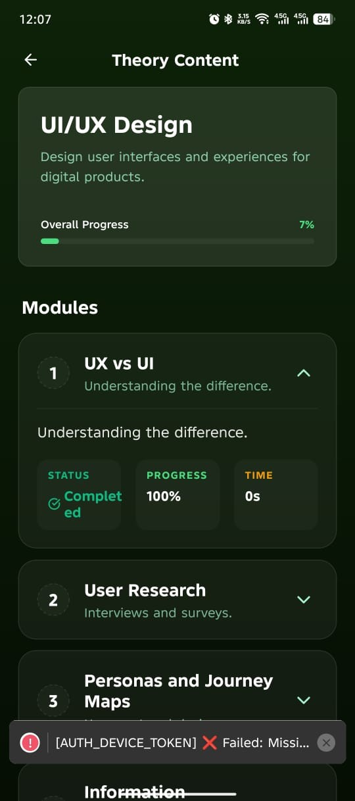

# OTP Authentication - Frontend Implementation Guide

## Architecture Overview

```
┌─────────────────────────────────────────────────────────────┐
│                      Frontend (React Native/Flutter)         │
└─────────────────────────────────────────────────────────────┘
                              │
                    1. Get FCM Token from Device
                              │
                    2. POST /register (email, password, phone)
                    ├─ Returns: uuid, name, email, isActivated: false
                              │
                    3. POST /device/register (uuid, FCM token)
                    ├─ Stores in Shared DB only
                              │
                    4. Backend auto-sends OTP via Firebase
                    ├─ Notification arrives on device
                              │
                    5. User enters OTP code
                              │
                    6. POST /otp/verify (uuid, sessionId, otpCode)
                    ├─ Sets isActivated: true
                              │
                    7. POST /login (email, password)
                    └─ Returns: JWT tokens (now activated)
```

---

## React Native Implementation

### 1. Setup Firebase Cloud Messaging

```bash
npm install @react-native-firebase/app @react-native-firebase/messaging
npx react-native link @react-native-firebase/messaging
```

**iOS (ios/Podfile):**

```ruby
target 'YourApp' do
  # ... existing pods
  pod 'FirebaseMessaging'
end
```

**Android (android/build.gradle):**

```gradle
dependencies {
  classpath 'com.google.gms:google-services:4.3.14'
}
```

---

### 2. Initialize Firebase Messaging

**setupFCM.js:**

```javascript
import messaging from '@react-native-firebase/messaging';
import AsyncStorage from '@react-native-async-storage/async-storage';

export const setupFCM = async () => {
  try {
    // Request notification permission (iOS)
    if (Platform.OS === 'ios') {
      await messaging().requestPermission();
    }

    // Get FCM token
    const token = await messaging().getToken();
    await AsyncStorage.setItem('fcmToken', token);
  
    console.log('✅ FCM Token obtained:', token.substring(0, 40) + '...');
    return token;
  } catch (error) {
    console.error('❌ FCM Setup Error:', error);
    return null;
  }
};

// Handle foreground notifications
export const listenToNotifications = () => {
  const unsubscribe = messaging().onMessage(async (remoteMessage) => {
    console.log('📬 Notification received:', remoteMessage.notification);
  
    // Handle OTP notification
    if (remoteMessage.data?.type === 'otp') {
      const otpCode = remoteMessage.data.code;
      // Auto-fill OTP input or show alert
      Alert.alert('OTP Code', `Your OTP: ${otpCode}`);
    }
  });

  return unsubscribe;
};
```

---

### 3. Registration Flow

**RegisterScreen.jsx:**

```javascript
import React, { useState, useEffect } from 'react';
import {
  View,
  TextInput,
  TouchableOpacity,
  Text,
  Alert,
  ScrollView,
} from 'react-native';
import AsyncStorage from '@react-native-async-storage/async-storage';
import { setupFCM } from './setupFCM';

const API_URL = 'http://your-backend.com/api/auth';

export default function RegisterScreen({ navigation }) {
  const [name, setName] = useState('');
  const [email, setEmail] = useState('');
  const [phone, setPhone] = useState('');
  const [password, setPassword] = useState('');
  const [loading, setLoading] = useState(false);
  const [fcmToken, setFcmToken] = useState(null);

  useEffect(() => {
    initializeFCM();
  }, []);

  const initializeFCM = async () => {
    const token = await setupFCM();
    setFcmToken(token);
  };

  const handleRegister = async () => {
    if (!name || !email || !phone || !password) {
      Alert.alert('Error', 'Please fill all fields');
      return;
    }

    if (!fcmToken) {
      Alert.alert('Error', 'Device not ready. Please restart app.');
      return;
    }

    setLoading(true);

    try {
      // STEP 1: Register user
      console.log('📝 STEP 1: Registering user...');
      const registerResponse = await fetch(`${API_URL}/student/register`, {
        method: 'POST',
        headers: { 'Content-Type': 'application/json' },
        body: JSON.stringify({
          name,
          email,
          phone,
          password,
          age: 20, // or get from user
        }),
      });

      const registerData = await registerResponse.json();

      if (!registerData.success) {
        Alert.alert('Registration Failed', registerData.message);
        setLoading(false);
        return;
      }

      const { uuid } = registerData.data;
      console.log('✅ User registered. UUID:', uuid);

      // Save for next step
      await AsyncStorage.setItem('userUUID', uuid);
      await AsyncStorage.setItem('userEmail', email);
      await AsyncStorage.setItem('userPassword', password);

      // STEP 2: Register device
      console.log('📱 STEP 2: Registering device...');
      const deviceResponse = await fetch(`${API_URL}/device/register`, {
        method: 'POST',
        headers: { 'Content-Type': 'application/json' },
        body: JSON.stringify({
          userUUID: uuid,
          deviceToken: fcmToken,
          deviceName: 'User Device',
          deviceType: 'ios', // or 'android'
        }),
      });

      const deviceData = await deviceResponse.json();

      if (!deviceData.success) {
        Alert.alert('Device Registration Failed', deviceData.message);
        setLoading(false);
        return;
      }

      console.log('✅ Device registered');

      // Navigate to OTP verification screen
      navigation.navigate('OTPVerification', {
        userUUID: uuid,
        email,
      });

    } catch (error) {
      Alert.alert('Error', error.message);
    } finally {
      setLoading(false);
    }
  };

  return (
    <ScrollView style={{ flex: 1, padding: 20 }}>
      <Text style={{ fontSize: 24, fontWeight: 'bold', marginBottom: 20 }}>
        Register
      </Text>

      <TextInput
        style={{
          borderWidth: 1,
          borderColor: '#ccc',
          padding: 10,
          marginBottom: 10,
          borderRadius: 5,
        }}
        placeholder="Full Name"
        value={name}
        onChangeText={setName}
      />

      <TextInput
        style={{
          borderWidth: 1,
          borderColor: '#ccc',
          padding: 10,
          marginBottom: 10,
          borderRadius: 5,
        }}
        placeholder="Email"
        value={email}
        onChangeText={setEmail}
        keyboardType="email-address"
      />

      <TextInput
        style={{
          borderWidth: 1,
          borderColor: '#ccc',
          padding: 10,
          marginBottom: 10,
          borderRadius: 5,
        }}
        placeholder="Phone"
        value={phone}
        onChangeText={setPhone}
        keyboardType="phone-pad"
      />

      <TextInput
        style={{
          borderWidth: 1,
          borderColor: '#ccc',
          padding: 10,
          marginBottom: 20,
          borderRadius: 5,
        }}
        placeholder="Password"
        value={password}
        onChangeText={setPassword}
        secureTextEntry
      />

      <TouchableOpacity
        style={{
          backgroundColor: '#007AFF',
          padding: 15,
          borderRadius: 5,
          alignItems: 'center',
        }}
        onPress={handleRegister}
        disabled={loading}
      >
        <Text style={{ color: 'white', fontSize: 16, fontWeight: '600' }}>
          {loading ? 'Registering...' : 'Register'}
        </Text>
      </TouchableOpacity>
    </ScrollView>
  );
}
```

---

### 4. OTP Verification Screen

**OTPVerificationScreen.jsx:**

```javascript
import React, { useState, useEffect } from 'react';
import {
  View,
  TextInput,
  TouchableOpacity,
  Text,
  Alert,
} from 'react-native';
import AsyncStorage from '@react-native-async-storage/async-storage';

const API_URL = 'http://your-backend.com/api/auth';

export default function OTPVerificationScreen({ route, navigation }) {
  const { userUUID } = route.params;
  const [otpCode, setOtpCode] = useState('');
  const [sessionId, setSessionId] = useState('');
  const [loading, setLoading] = useState(false);
  const [timer, setTimer] = useState(600); // 10 minutes

  useEffect(() => {
    const interval = setInterval(() => {
      setTimer(prev => (prev > 0 ? prev - 1 : 0));
    }, 1000);
    return () => clearInterval(interval);
  }, []);

  // Get session ID from stored OTP record or wait for it
  useEffect(() => {
    // In production, you'd get this from the OTP send response
    // For now, we store it from the previous step
    const getSessionId = async () => {
      const stored = await AsyncStorage.getItem('sessionId');
      if (stored) setSessionId(stored);
    };
    getSessionId();
  }, []);

  const handleVerifyOTP = async () => {
    if (!otpCode || otpCode.length !== 6) {
      Alert.alert('Error', 'Please enter 6-digit OTP code');
      return;
    }

    if (!sessionId) {
      Alert.alert('Error', 'Session ID not found. Please register device again.');
      return;
    }

    setLoading(true);

    try {
      console.log('✅ STEP 3: Verifying OTP...');
      const response = await fetch(`${API_URL}/otp/verify`, {
        method: 'POST',
        headers: { 'Content-Type': 'application/json' },
        body: JSON.stringify({
          userUUID,
          sessionId,
          otpCode,
        }),
      });

      const data = await response.json();

      if (!data.success) {
        Alert.alert('Verification Failed', data.message);
        setLoading(false);
        return;
      }

      console.log('✅ OTP verified successfully!');
      Alert.alert('Success', 'Account activated! You can now login.');

      // Navigate to login
      navigation.navigate('Login');

    } catch (error) {
      Alert.alert('Error', error.message);
    } finally {
      setLoading(false);
    }
  };

  const minutes = Math.floor(timer / 60);
  const seconds = timer % 60;

  return (
    <View style={{ flex: 1, padding: 20, justifyContent: 'center' }}>
      <Text style={{ fontSize: 24, fontWeight: 'bold', marginBottom: 10 }}>
        Verify OTP
      </Text>

      <Text style={{ fontSize: 14, color: '#666', marginBottom: 20 }}>
        Enter the 6-digit OTP code sent to your device
      </Text>

      <TextInput
        style={{
          borderWidth: 2,
          borderColor: '#007AFF',
          padding: 15,
          marginBottom: 20,
          borderRadius: 5,
          fontSize: 24,
          letterSpacing: 10,
          textAlign: 'center',
        }}
        placeholder="000000"
        value={otpCode}
        onChangeText={setOtpCode}
        keyboardType="number-pad"
        maxLength={6}
      />

      <Text style={{ textAlign: 'center', marginBottom: 20, color: '#666' }}>
        Time remaining: {minutes}:{seconds.toString().padStart(2, '0')}
      </Text>

      <TouchableOpacity
        style={{
          backgroundColor: '#007AFF',
          padding: 15,
          borderRadius: 5,
          alignItems: 'center',
          marginBottom: 10,
        }}
        onPress={handleVerifyOTP}
        disabled={loading}
      >
        <Text style={{ color: 'white', fontSize: 16, fontWeight: '600' }}>
          {loading ? 'Verifying...' : 'Verify OTP'}
        </Text>
      </TouchableOpacity>

      <TouchableOpacity onPress={() => navigation.goBack()}>
        <Text style={{ textAlign: 'center', color: '#007AFF' }}>
          Go Back
        </Text>
      </TouchableOpacity>
    </View>
  );
}
```

---

## Flutter Implementation

### 1. Setup Firebase Cloud Messaging

**pubspec.yaml:**

```yaml
dependencies:
  firebase_core: ^2.24.0
  firebase_messaging: ^14.6.0
  shared_preferences: ^2.2.0
```

### 2. Initialize Firebase

**main.dart:**

```dart
import 'package:firebase_core/firebase_core.dart';
import 'package:firebase_messaging/firebase_messaging.dart';

void main() async {
  WidgetsFlutterBinding.ensureInitialized();
  
  // Initialize Firebase
  await Firebase.initializeApp();
  
  // Setup FCM
  setupFCM();
  
  runApp(const MyApp());
}

void setupFCM() async {
  // Request permission (iOS)
  await FirebaseMessaging.instance.requestPermission();
  
  // Get FCM token
  String? token = await FirebaseMessaging.instance.getToken();
  print('✅ FCM Token: ${token?.substring(0, 40)}...');
  
  // Save token
  final prefs = await SharedPreferences.getInstance();
  await prefs.setString('fcmToken', token ?? '');
  
  // Listen to foreground messages
  FirebaseMessaging.onMessage.listen((RemoteMessage message) {
    print('📬 Notification: ${message.notification?.title}');
  
    // Handle OTP notification
    if (message.data['type'] == 'otp') {
      String otpCode = message.data['code'];
      showDialog(
        context: navigatorKey.currentContext!,
        builder: (_) => AlertDialog(
          title: const Text('OTP Code'),
          content: Text('Your OTP: $otpCode'),
          actions: [
            TextButton(
              onPressed: () => Navigator.pop(navigatorKey.currentContext!),
              child: const Text('OK'),
            ),
          ],
        ),
      );
    }
  });
}
```

### 3. Registration Screen

**registration_screen.dart:**

```dart
import 'package:flutter/material.dart';
import 'package:http/http.dart' as http;
import 'package:shared_preferences/shared_preferences.dart';
import 'dart:convert';

class RegistrationScreen extends StatefulWidget {
  @override
  State<RegistrationScreen> createState() => _RegistrationScreenState();
}

class _RegistrationScreenState extends State<RegistrationScreen> {
  final _nameController = TextEditingController();
  final _emailController = TextEditingController();
  final _phoneController = TextEditingController();
  final _passwordController = TextEditingController();
  
  bool _loading = false;
  String _fcmToken = '';
  
  const String API_URL = 'http://your-backend.com/api/auth';

  @override
  void initState() {
    super.initState();
    _getFCMToken();
  }

  Future<void> _getFCMToken() async {
    final prefs = await SharedPreferences.getInstance();
    setState(() {
      _fcmToken = prefs.getString('fcmToken') ?? '';
    });
  }

  Future<void> _handleRegister() async {
    if (_nameController.text.isEmpty ||
        _emailController.text.isEmpty ||
        _phoneController.text.isEmpty ||
        _passwordController.text.isEmpty) {
      ScaffoldMessenger.of(context).showSnackBar(
        const SnackBar(content: Text('Please fill all fields')),
      );
      return;
    }

    if (_fcmToken.isEmpty) {
      ScaffoldMessenger.of(context).showSnackBar(
        const SnackBar(content: Text('Device not ready')),
      );
      return;
    }

    setState(() => _loading = true);

    try {
      // STEP 1: Register user
      print('📝 STEP 1: Registering user...');
      final registerResponse = await http.post(
        Uri.parse('$API_URL/student/register'),
        headers: {'Content-Type': 'application/json'},
        body: jsonEncode({
          'name': _nameController.text,
          'email': _emailController.text,
          'phone': _phoneController.text,
          'password': _passwordController.text,
          'age': 20,
        }),
      );

      if (registerResponse.statusCode != 201) {
        throw Exception('Registration failed');
      }

      final registerData = jsonDecode(registerResponse.body);
      final userUUID = registerData['data']['uuid'];
    
      print('✅ User registered. UUID: $userUUID');

      // Save for next step
      final prefs = await SharedPreferences.getInstance();
      await prefs.setString('userUUID', userUUID);
      await prefs.setString('userEmail', _emailController.text);
      await prefs.setString('userPassword', _passwordController.text);

      // STEP 2: Register device
      print('📱 STEP 2: Registering device...');
      final deviceResponse = await http.post(
        Uri.parse('$API_URL/device/register'),
        headers: {'Content-Type': 'application/json'},
        body: jsonEncode({
          'userUUID': userUUID,
          'deviceToken': _fcmToken,
          'deviceName': 'User Device',
          'deviceType': 'android', // or 'ios'
        }),
      );

      if (deviceResponse.statusCode != 200) {
        throw Exception('Device registration failed');
      }

      print('✅ Device registered');

      // Navigate to OTP screen
      if (mounted) {
        Navigator.of(context).push(
          MaterialPageRoute(
            builder: (_) => OTPVerificationScreen(userUUID: userUUID),
          ),
        );
      }

    } catch (error) {
      ScaffoldMessenger.of(context).showSnackBar(
        SnackBar(content: Text('Error: $error')),
      );
    } finally {
      setState(() => _loading = false);
    }
  }

  @override
  Widget build(BuildContext context) {
    return Scaffold(
      appBar: AppBar(title: const Text('Register')),
      body: SingleChildScrollView(
        padding: const EdgeInsets.all(20),
        child: Column(
          children: [
            TextField(
              controller: _nameController,
              decoration: const InputDecoration(
                labelText: 'Full Name',
                border: OutlineInputBorder(),
              ),
            ),
            const SizedBox(height: 15),
            TextField(
              controller: _emailController,
              decoration: const InputDecoration(
                labelText: 'Email',
                border: OutlineInputBorder(),
              ),
              keyboardType: TextInputType.emailAddress,
            ),
            const SizedBox(height: 15),
            TextField(
              controller: _phoneController,
              decoration: const InputDecoration(
                labelText: 'Phone',
                border: OutlineInputBorder(),
              ),
              keyboardType: TextInputType.phone,
            ),
            const SizedBox(height: 15),
            TextField(
              controller: _passwordController,
              decoration: const InputDecoration(
                labelText: 'Password',
                border: OutlineInputBorder(),
              ),
              obscureText: true,
            ),
            const SizedBox(height: 25),
            ElevatedButton(
              onPressed: _loading ? null : _handleRegister,
              child: Text(_loading ? 'Registering...' : 'Register'),
            ),
          ],
        ),
      ),
    );
  }

  @override
  void dispose() {
    _nameController.dispose();
    _emailController.dispose();
    _phoneController.dispose();
    _passwordController.dispose();
    super.dispose();
  }
}
```

### 4. OTP Verification Screen - Flutter

**otp_verification_screen.dart:**

```dart
import 'package:flutter/material.dart';
import 'package:http/http.dart' as http;
import 'package:shared_preferences/shared_preferences.dart';
import 'dart:convert';
import 'dart:async';

class OTPVerificationScreen extends StatefulWidget {
  final String userUUID;
  
  const OTPVerificationScreen({required this.userUUID});

  @override
  State<OTPVerificationScreen> createState() => _OTPVerificationScreenState();
}

class _OTPVerificationScreenState extends State<OTPVerificationScreen> {
  final _otpController = TextEditingController();
  bool _loading = false;
  int _timer = 600; // 10 minutes
  String _sessionId = '';
  
  const String API_URL = 'http://your-backend.com/api/auth';

  @override
  void initState() {
    super.initState();
    _startTimer();
    _getSessionId();
  }

  Future<void> _getSessionId() async {
    final prefs = await SharedPreferences.getInstance();
    setState(() {
      _sessionId = prefs.getString('sessionId') ?? '';
    });
  }

  void _startTimer() {
    Timer.periodic(Duration(seconds: 1), (timer) {
      if (_timer > 0) {
        setState(() => _timer--);
      } else {
        timer.cancel();
      }
    });
  }

  Future<void> _handleVerifyOTP() async {
    if (_otpController.text.length != 6) {
      ScaffoldMessenger.of(context).showSnackBar(
        const SnackBar(content: Text('Please enter 6-digit OTP')),
      );
      return;
    }

    if (_sessionId.isEmpty) {
      ScaffoldMessenger.of(context).showSnackBar(
        const SnackBar(content: Text('Session ID not found')),
      );
      return;
    }

    setState(() => _loading = true);

    try {
      print('✅ STEP 3: Verifying OTP...');
      final response = await http.post(
        Uri.parse('$API_URL/otp/verify'),
        headers: {'Content-Type': 'application/json'},
        body: jsonEncode({
          'userUUID': widget.userUUID,
          'sessionId': _sessionId,
          'otpCode': _otpController.text,
        }),
      );

      if (response.statusCode != 200) {
        final error = jsonDecode(response.body);
        throw Exception(error['message']);
      }

      ScaffoldMessenger.of(context).showSnackBar(
        const SnackBar(content: Text('OTP verified! You can now login.')),
      );

      if (mounted) {
        Navigator.of(context).pushReplacementNamed('/login');
      }

    } catch (error) {
      ScaffoldMessenger.of(context).showSnackBar(
        SnackBar(content: Text('Error: $error')),
      );
    } finally {
      setState(() => _loading = false);
    }
  }

  @override
  Widget build(BuildContext context) {
    final minutes = _timer ~/ 60;
    final seconds = _timer % 60;

    return Scaffold(
      appBar: AppBar(title: const Text('Verify OTP')),
      body: Padding(
        padding: const EdgeInsets.all(20),
        child: Column(
          mainAxisAlignment: MainAxisAlignment.center,
          children: [
            const Text(
              'Enter OTP Code',
              style: TextStyle(fontSize: 24, fontWeight: FontWeight.bold),
            ),
            const SizedBox(height: 10),
            const Text('Check your device for OTP notification'),
            const SizedBox(height: 30),
            TextField(
              controller: _otpController,
              decoration: const InputDecoration(
                hintText: '000000',
                border: OutlineInputBorder(),
              ),
              keyboardType: TextInputType.number,
              maxLength: 6,
              textAlign: TextAlign.center,
              style: const TextStyle(fontSize: 24, letterSpacing: 10),
            ),
            const SizedBox(height: 20),
            Text(
              'Time: $minutes:${seconds.toString().padLeft(2, '0')}',
              style: const TextStyle(color: Colors.grey),
            ),
            const SizedBox(height: 30),
            ElevatedButton(
              onPressed: _loading ? null : _handleVerifyOTP,
              child: Text(_loading ? 'Verifying...' : 'Verify OTP'),
            ),
          ],
        ),
      ),
    );
  }

  @override
  void dispose() {
    _otpController.dispose();
    super.dispose();
  }
}
```

---

## Complete Flow Summary

| Step | Action             | Endpoint                   | Response                         |
| ---- | ------------------ | -------------------------- | -------------------------------- |
| 1    | Register user      | `POST /student/register` | `uuid`, `isActivated: false` |
| 2    | Register device    | `POST /device/register`  | Device saved to Shared DB        |
| 3    | Firebase sends OTP | (Backend)                  | Notification to device           |
| 4    | User enters OTP    | `POST /otp/verify`       | `isActivated: true`            |
| 5    | Login              | `POST /student/login`    | JWT tokens                       |

---

## Error Handling

```javascript
// Common errors to handle:
const handleErrors = (response) => {
  const {status, data} = response;
  
  switch(status) {
    case 409: // User exists
      return 'Email or phone already registered';
    case 400: // Invalid device token
      return 'Device token invalid. Please restart app.';
    case 401: // Wrong OTP
      return 'Wrong OTP code. Try again.';
    case 429: // Rate limited
      return 'Too many attempts. Wait 15 minutes.';
    default:
      return 'An error occurred';
  }
};
```

---

## Testing Checklist

- [ ] FCM token obtained from device
- [ ] User registration returns UUID
- [ ] Device token saved to Shared DB
- [ ] OTP notification received on device
- [ ] OTP code auto-fills or can be entered manually
- [ ] OTP verification activates account
- [ ] Login works post-activation
- [ ] Wrong OTP shows error
- [ ] Timer countdown works
- [ ] Rate limiting works (5 attempts max)

---

## Security Best Practices

✅ **Done:**

- OTP valid for 10 minutes only
- Max 5 verification attempts
- Session ID for tracking
- Rate limiting on auth endpoints
- Device tokens stored in Shared DB only

✅ **Implement on Frontend:**

- Store tokens only in secure storage (not AsyncStorage)
- Never log sensitive data
- Clear auth data on logout
- Validate email format
- Validate phone format
- Hash password before sending (use HTTPS)
